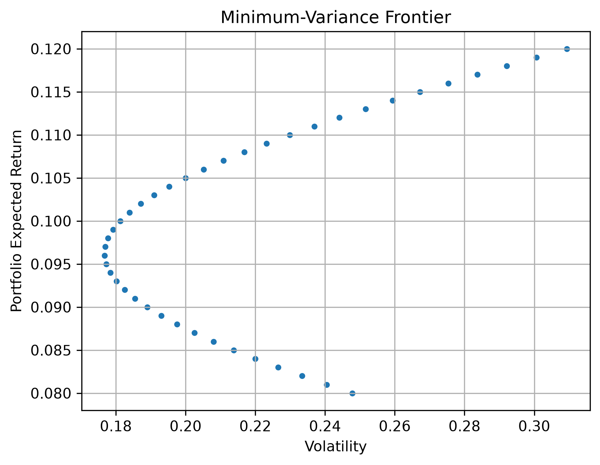

# Portfolio Optimizer

A short Python project implementing mean-variance portfolio optimization from first principles using a custom-made matrix library.

The project was built primarily as an exercise in applying linear algebra, probability, and optimization to a quantitative finance problem.

## Overview

The project implements functions to:

* Calculate portfolio expected return
* Calculate portfolio variance and volatility
* Find the global minimum-variance portfolio
* Find the minimum-variance portfolio for a given target return
* Find a portfolio which maximises the Sharpe ratio
* Generate the minimum-variance/efficient frontier

All matrix operations used by the optimizer are performed using a custom matrix library developed separately from this project.

---
# Mathematical Background

## Expected Portfolio Return

The expected return of a portfolio is

$$
E(R_p)=\vec{w}^{,T}\vec{\mu}
$$

where:

* $\vec{w}$ is the vector of portfolio weights:

$$
\vec{w}=
\begin{bmatrix} 
w_1\\
w_2\\
\vdots\\
w_n
\end{bmatrix}
$$

where $w_i$ is the weight assigned to the $i$-th asset.

* $\vec{\mu}$ is the vector of expected asset returns:

$$
\vec{\mu}=
\begin{bmatrix}
E(R_1)\\
E(R_2)\\
\vdots\\
E(R_n)
\end{bmatrix}
$$

where $E(R_i)$ is the expected return of the $i$-th asset.

## Portfolio Variance

Portfolio variance can be written in matrix form as

$$
\\mathrm{Var}(R_p) = \vec{w}^{,T}\Sigma\vec{w}
$$

where $\Sigma$ is the covariance matrix of asset returns.

For $n$ assets, $\Sigma$ is an $n\times n$ matrix whose $(i,j)^{th}$ entry is the covariance between the returns of assets $i$ and $j$:

$$
\Sigma_{ij}=\mathrm{Cov}(R_i,R_j).
$$

The diagonal entries therefore contain the individual asset variances:

$$
\Sigma_{ii}=\\mathrm{Var}(R_i).
$$

The off-diagonal entries describe how the returns of different assets move together.

---
# Optimization

## 1. Global Minimum-Variance Portfolio

The first optimization problem is to minimize portfolio variance subject to the constraint that the portfolio weights add up to one:

$$
\min_{\vec{w}}\quad
\vec{w}^{,T}\Sigma\vec{w}
$$

subject to

$$
\vec{1}^{T}\vec{w}=1,
$$

where $\vec{1}$ is a vector of ones with the same dimension as $\vec{w}$.

Using a Lagrange multiplier $\lambda$, define

$$
L(\vec{w},\lambda) = \vec{w}^{,T}\Sigma\vec{w}  - \lambda(\vec{1}^{,T}\vec{w}-1).
$$

Setting the derivative with respect to $\vec{w}$ equal to zero gives the first-order condition

$$
2\Sigma\vec{w}-\lambda\vec{1} = 0.
$$

Rearranging:

$$
\vec{w} = \frac{\lambda}{2}\Sigma^{-1}\vec{1}.
$$

Applying the constraint $\vec{1}^{T}\vec{w}=1$:

$$
\vec{1}^{T}
\left(
\frac{\lambda}{2}\Sigma^{-1}\vec{1}
\right)
= 1.
$$

Therefore,

$$
\lambda =
\frac{2}
{\vec{1}^{T}\Sigma^{-1}\vec{1}}.
$$

Substituting this back into the expression for $\vec{w}$ gives the global minimum-variance portfolio:

$$
\boxed{
\vec{w}^{,*}
=
\frac{\Sigma^{-1}\vec{1}}
{\vec{1}^{T}\Sigma^{-1}\vec{1}}
}
$$

This expression is independent of the Lagrange multiplier and can therefore be directly implemented using the matrix operations provided by the custom matrix library.

---
## 2. Minimum-Variance Portfolio for a Target Return

A more general optimization problem is to minimize portfolio variance while requiring the portfolio to achieve a specified target expected return $r$:

$$
\min_{\vec{w}}\quad
\vec{w}^{T}\Sigma\vec{w}
$$

subject to

$$
\vec{1}^{T}\vec{w}=1
$$

and

$$
\vec{\mu}^{T}\vec{w}=r.
$$

The first constraint ensures that all portfolio weights sum to one, while the second requires the portfolio to have an expected return of $r$.

Using two Lagrange multipliers, $\lambda_1$ and $\lambda_2$, define

$$
L(\vec{w},\lambda_1,\lambda_2) =
\vec{w}^{,T}\Sigma\vec{w} - \lambda_1(\vec{1}^{,T}\vec{w}-1) - \lambda_2(\vec{\mu}^{,T}\vec{w}-r).
$$

Setting the derivative with respect to $\vec{w}$ equal to zero gives

$$
2\Sigma\vec{w} - \lambda_1\vec{1} - \lambda_2\vec{\mu} = 0
$$

Therefore,

$$
\vec{w} = \frac{\lambda_1}{2}\Sigma^{-1}\vec{1} + \frac{\lambda_2}{2}\Sigma^{-1}\vec{\mu}.
$$

Substituting this expression into the two constraints produces the system

$$ \begin{bmatrix} 
\vec{1}^{T}\Sigma^{-1}\vec{1} & \vec{1}^{T}\Sigma^{-1}\vec{\mu}\\ 
\vec{1}^{T}\Sigma^{-1}\vec{\mu} & \vec{\mu}^{T}\Sigma^{-1}\vec{\mu} 
\end{bmatrix} 
\begin{bmatrix} 
\lambda_1\\ 
\lambda_2 
\end{bmatrix} = 
\begin{bmatrix} 
2\\ 
2r 
\end{bmatrix}. $$

The coefficients of this system are calculated using matrix operations and the resulting $2\times2$ system is solved using the custom linear system solver.

Once $\lambda_1$ and $\lambda_2$ have been obtained, they are substituted back into

$$
\vec{w} = \frac{\lambda_1}{2}\Sigma^{-1}\vec{1} + \frac{\lambda_2}{2}\Sigma^{-1}\vec{\mu}
$$

to obtain the minimum-variance portfolio for the specified target return.

Repeating this process for a range of target returns produces the minimum-variance frontier.

---
## 3. Maximum Sharpe Ratio Portfolio

The Sharpe ratio measures the excess return of a portfolio relative to its volatility:

$$
S(\vec{w}) =
\frac{\vec{w}^{,T}\vec{v}}
{\sqrt{\vec{w}^{T}\Sigma\vec{w}}},
$$

where

$$
\vec{v} = \vec{\mu}-r_f\vec{1}
$$

is the vector of expected excess returns and $r_f$ is the risk-free rate.

Directly maximizing this ratio is inconvenient because it is a ratio of two functions of $\vec{w}$. However, the Sharpe ratio is unchanged when all portfolio weights are multiplied by the same positive constant.

Therefore, we can impose the normalization

$$
\vec{v}^{T}\vec{w} = 1.
$$

The problem can then be written as minimizing portfolio variance subject to two constraints:

$$
\min_{\vec{w}}\quad
\vec{w}^{T}\Sigma\vec{w}
$$

subject to

$$
\vec{v}^{T}\vec{w} = 1
$$

and

$$
\vec{1}^{T}\vec{w} = 1.
$$

Using two Lagrange multipliers gives

$$
L(\vec{w},\lambda_1,\lambda_2) = \vec{w}^{T}\Sigma\vec{w} - \lambda_1(\vec{v}^{T}\vec{w}-1) - \lambda_2(\vec{1}^{T}\vec{w}-1).
$$

The first-order condition is

$$
2\Sigma\vec{w} - \lambda_1\vec{v} - \lambda_2\vec{1} = 0.
$$

Rearranging gives

$$
\vec{w} = \frac{\lambda_1}{2}\Sigma^{-1}\vec{v} + \frac{\lambda_2}{2}\Sigma^{-1}\vec{1}.
$$

Substituting this into the two constraints produces a $2\times2$ system in $\lambda_1$ and $\lambda_2$:

$$
\begin{bmatrix}
\vec{1}^{T}\Sigma^{-1}\vec{v} & \vec{1}^{T}\Sigma^{-1}\vec{1}\\
\vec{v}^{T}\Sigma^{-1}\vec{v} & \vec{1}^{T}\Sigma^{-1}\vec{v}
\end{bmatrix}
\begin{bmatrix}
\lambda_1\\
\lambda_2
\end{bmatrix}
= \begin{bmatrix}
2\\
2
\end{bmatrix}.
$$

This system is solved using the custom linear system solver. The resulting multipliers are then substituted into

$$
\vec{w} = \frac{\lambda_1}{2}\Sigma^{-1}\vec{a} + \frac{\lambda_2}{2}\Sigma^{-1}\vec{1}
$$

to obtain the portfolio weights.

The implementation does not impose non-negative weight constraints, meaning that negative weights and therefore short positions are possible.

---
# Results

For demonstration, the project uses three assets with the following expected returns:

$$
\vec{\mu} =
\begin{bmatrix}
0.10\\
0.08\\
0.12
\end{bmatrix}
$$

and covariance matrix

$$
\Sigma =
\begin{bmatrix}
0.04 & 0.01 & 0.02\\
0.01 & 0.09 & 0.03\\
0.02 & 0.03 & 0.16
\end{bmatrix}.
$$

The minimum-variance optimizer can be evaluated across a range of target returns. Plotting portfolio expected return against portfolio volatility produces the characteristic minimum-variance frontier.

The project also implements maximum-Sharpe-ratio optimization for a specified risk-free rate.

---
# Implementation

The optimization routines rely on a custom matrix library developed separately from this project.

The library implements matrix operations including:

* Matrix addition and subtraction
* Matrix multiplication
* Scalar multiplication
* Transposition
* Gaussian elimination
* Reduced row echelon form
* Determinants
* Matrix inversion
* Matrix rank
* Linear system solving
* Vector and matrix operations

This allows the portfolio optimization problems to be implemented directly from their mathematical formulations without relying on NumPy for the underlying linear algebra.

---
# Limitations

This project is intended as a small educational implementation rather than a production portfolio optimization system.

Some limitations include:

* The covariance matrix and expected returns are manually specified.
* The implementation does not use historical market data.
* No transaction costs or other trading costs are considered.
* No constraints are imposed to prevent short selling. (leading to portfolio weights taking on absurd values on occassion)
* The custom matrix library is considerably less efficient than established numerical libraries such as NumPy.
* Matrix inversion is used directly rather than more numerically stable approaches such as solving linear systems.

These limitations are intentional: the primary purpose of the project is to understand and implement the mathematical foundations of portfolio optimization.

---
# Future Improvements

Possible extensions include:

* Estimating expected returns and covariance matrices from historical data
* Adding no-short-selling constraints
* Adding maximum/minimum position constraints
* Comparing the custom implementation with NumPy/SciPy
* Testing the optimizer on real market data
* Adding transaction costs and other portfolio constraints

---

# Conclusion

This project demonstrates how concepts from linear algebra, probability, and constrained optimization can be combined to construct a basic-level portfolio optimizer.

Rather than treating portfolio optimization as a black-box numerical problem, the main optimization results were derived mathematically using Lagrange multipliers and then translated into Python using a custom matrix library.

The resulting implementation provides a small example of how mathematical theory can be taken from a set of equations and turned into working computational code.
